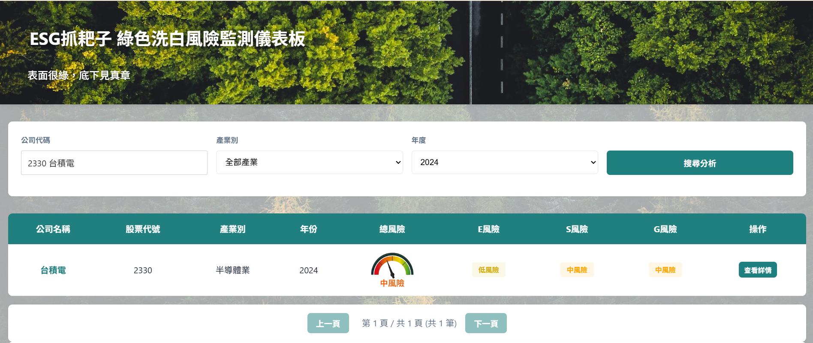
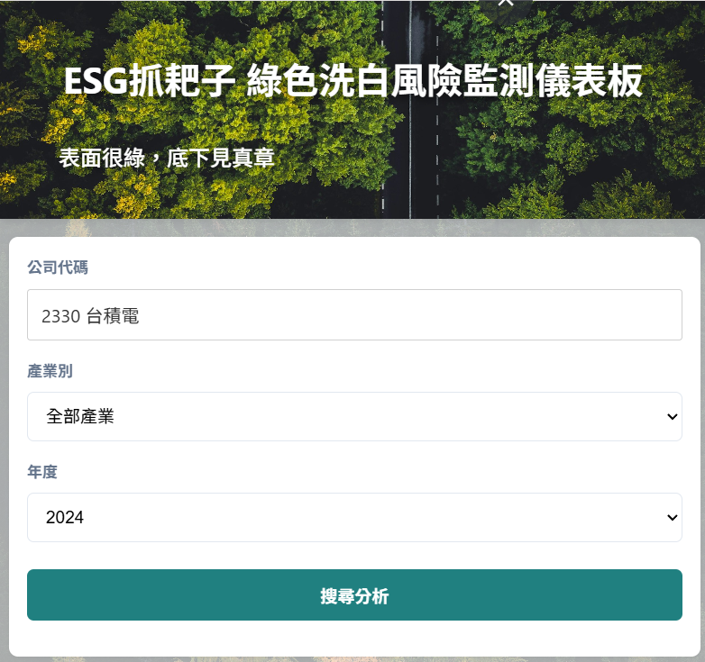
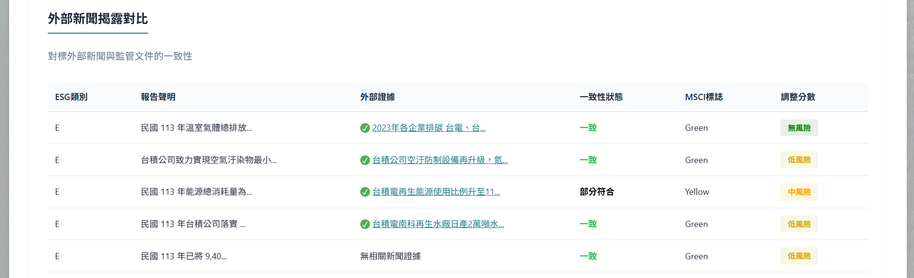
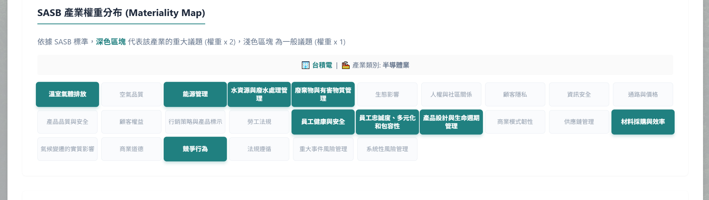
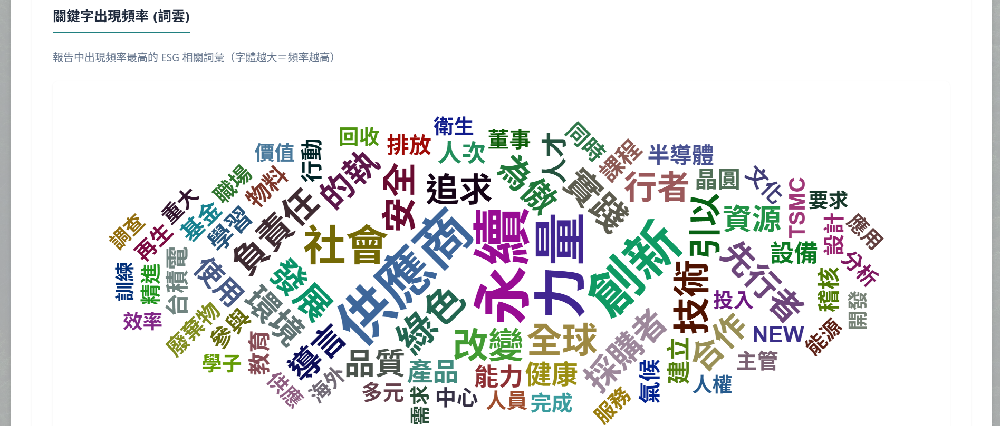
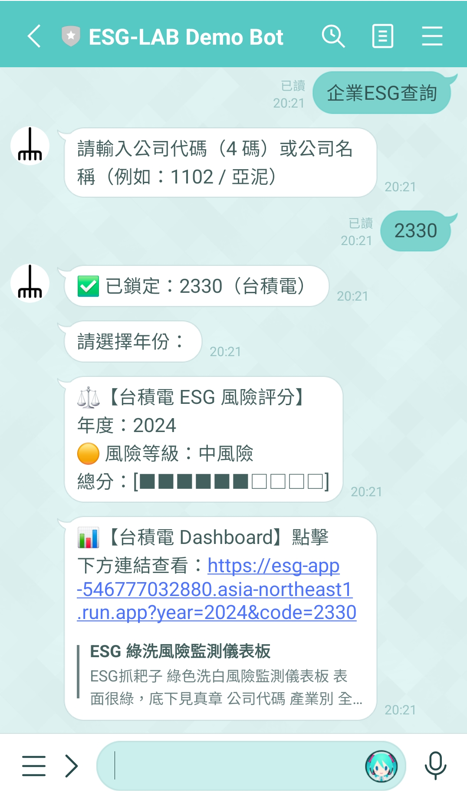
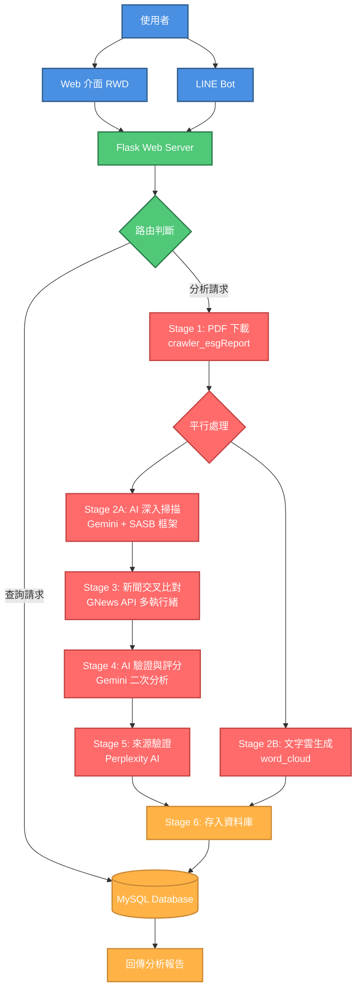

# 別讓永續變成口號！ESG抓耙子：綠色洗白風險儀表板

---

### 為什麼要做這個專案？

在 ESG 浪潮下，企業紛紛交出永續報告書，但內容動輒數百頁，對投資人或監管機構來說，要找出「說一套做一套」的**漂綠（Greenwashing）**行為就像大海撈針。

我們開發了這套系統，目的是透過 AI 的力量，自動化地審閱這些報告，並抓取外部新聞進行「實話對決」，讓企業的永續主張無所遁形。

---

## 成果展示 (介面截圖)

* **視覺化儀表板：** 一眼看出這家公司的 ESG 風險等級。
> 

* **自適應版面 (RWD)：** 無論是用電腦深入研究，還是用手機隨手查詢，版面都會自動調整，提供最舒適的閱讀體驗。
> 

* **分析清單：** 列出「企業主張」vs「外部證據」的對比，給每個項目出風險分數。
> 

* **SASB 產業權重分布：** 快速看出該產業的重點在哪裡。
> 

* **關鍵字雲：** 快速掌握報告書的重點是什麼。
> 

* **Line Bot 隨身查：** 透過 Line Bot 查詢公司 ESG 風險分數。
> 

---

## 核心功能：多端互動，資訊不漏接

-  與其只叫 AI 總結摘要，我們設計了一套嚴謹的**三階段驗證流程**：

    - **AI 深入掃描 (P1)：** 依據國際權威的 **SASB 框架**與學術界公認的 **Clarkson 2008 評分邏輯**，對 PDF 進行逐頁分析，找出潛在的誇大疑點。
    - **即時新聞交叉比對 (P2)：** 串接 **GNews API** 抓取與該議題相關的新聞。如果報告說環境保護做得很好，但新聞卻有汙染裁罰紀錄，系統會自動標記矛盾。
    - **證據真實性檢驗 (P3)：** 擔心 AI 產生幻覺（Hallucination）或網址失效？我們整合了 **Perplexity AI** 自動修復並驗證所有證據來源的真實性。

- Line Bot 隨身查：

    - 我們特別開發了專屬的 Line Bot，使用者只要輸入公司代碼，就能秒查資料庫中的 ESG 總分。
    - 機器人會提供外連網址，直接引導使用者回到主網站查看更精確的分析報告。
    - 技術亮點：這是一個不依賴官方 SDK，完全由 Flask 從底層實作的 Line Bot，展現對 Webhook 與 API 協議的掌握度。

- 全裝置自適應 (RWD)：網站具備自適應功能，無論是用電腦大螢幕進行深度研究，還是用手機隨手查詢，都能享有流暢的閱讀體驗。
---

## 技術實作：我們如何解決遇到的問題？

在開發過程中，我們遇到不少挑戰，來看我們如何「讓系統更耐操」：
* **模組化大亂鬥：** 專案初期各項功能各跑各的，我們學會了「模組化」，將爬蟲、AI、資料庫操作整合進統一的 Pipeline，確保自動化流程一氣呵成。
* **自動化爬蟲 pipeline：** 公開資訊觀測站的 PDF 多為外連到企業官方網站，格式雜亂讓我們一度在初期就卡住，我們發現多家網站背後都連向了『ESG 數位平台』，透過分析背後邏輯成功設計了自動化爬蟲功能。
* **新聞搜尋開天窗：** GNews 搜尋常因為關鍵字問題而抓不到東西，我們實作了三層 Fallback 機制，讓系統能自動從「特定詞」切換到「產業關鍵字」再到「基本組合」，確保分析不中斷。
* **多執行緒搜尋：** 新聞搜尋受限於GNews API的限制，實際上是最耗時的階段，我們改用多執行緒同時抓取多個議題的資料，不再讓系統傻傻排隊。
* **平行處理：** 我們把「文字雲生成」跟「AI 分析」拆開同步執行，省下部分等待時間。
* **斷點續傳機制：** 面對 API 斷線或系統意外中斷，我們實作了狀態紀錄功能。系統能自動識別資料庫中的 stageN 狀態，當使用者重新整理或重啟時，可以選擇 **從斷點繼續** 而不需要浪費額外的 API 額度重頭來過。
---

## 系統架構圖

我們將複雜的流程拆解為清晰的模組化結構：

---

## 雲端部署 (Quick Start for Techies)
本專案已完整遷移至 Google Cloud Platform (GCP)，採用容器化架構，確保環境一致性：

環境變數設定：參考 .env.example 準備好你的 API_KEY 與資料庫連線資訊。

建立 Docker 映像檔：我們使用 Artifact Registry 來存放映像檔。

雲端基礎建設：
- 運算：使用 Cloud Run 部署 Flask App，因為涉及大檔案傳輸，建議配置至少 2GiB 記憶體。
- 資料庫：使用 Cloud SQL (MySQL) 儲存分析結果。
- 儲存：使用 Cloud Storage (GCS) 來存放下載的 PDF 報告與生成的 JSON 暫存檔。
- 部署：透過 GCP 的第二代執行環境掛載 GCS，並利用 Cloud SQL Connector 確保連線安全。

---

## 未來優化方向 (Roadmap)
雖然系統已經跑得很穩，但身為開發者，我們還有更多想玩的：

- 非同步任務佇列 (Celery + Redis)： 目前雖然有多執行緒，但使用者還是得開著網頁，並且原本的分析任務會占用大量記憶體。未來計畫引入 Celery，讓分析任務在後台跑，分析好了再透過通知跟使用者說。

- 更多元的資料來源： 整合「環保署處分紀錄」與「勞基法違規」等政府 Open Data，讓 AI 不只看新聞，還能查企業的違規「黑歷史」。

- 專屬「ESG 顧問」： 透過檢索增強生成 (RAG)，讓使用者不只能看數據，還能跟網頁內嵌的聊天助手提問或瞎聊，讓系統變得「有生命」。

- 機器學習模型：導入定量數據分析，利用過往漂綠案例訓練模型，實現對企業數據造假的「異常偵測」與預警標籤。